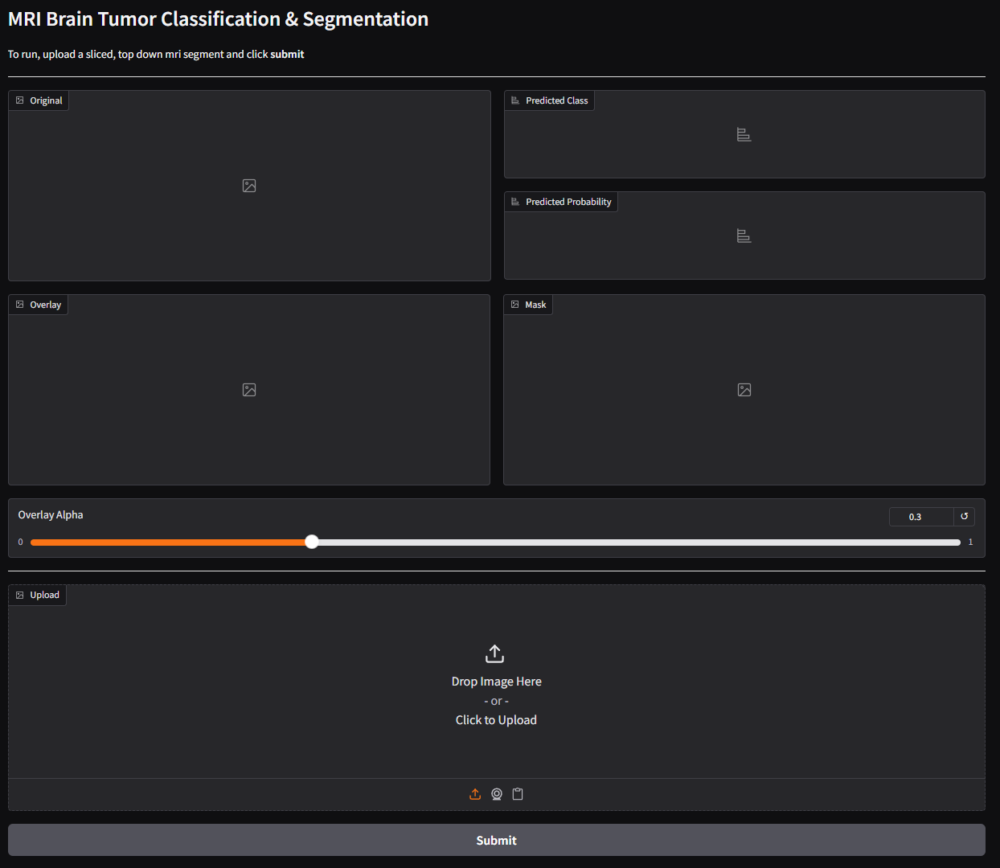
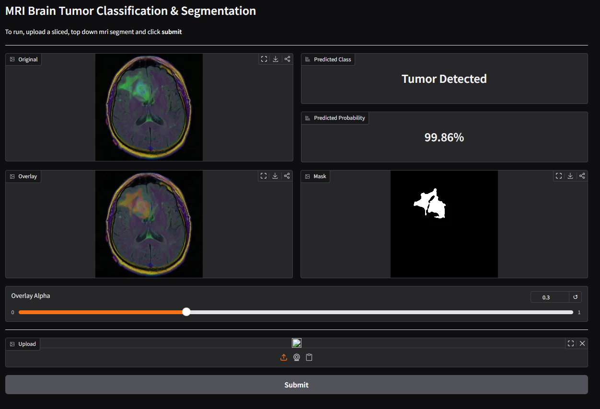
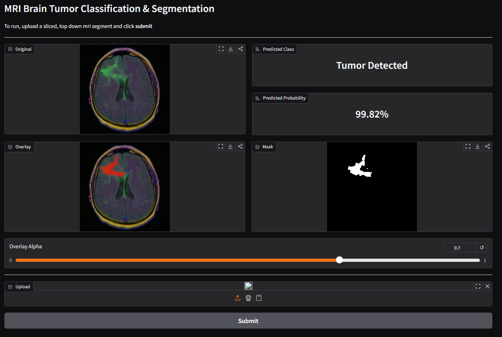
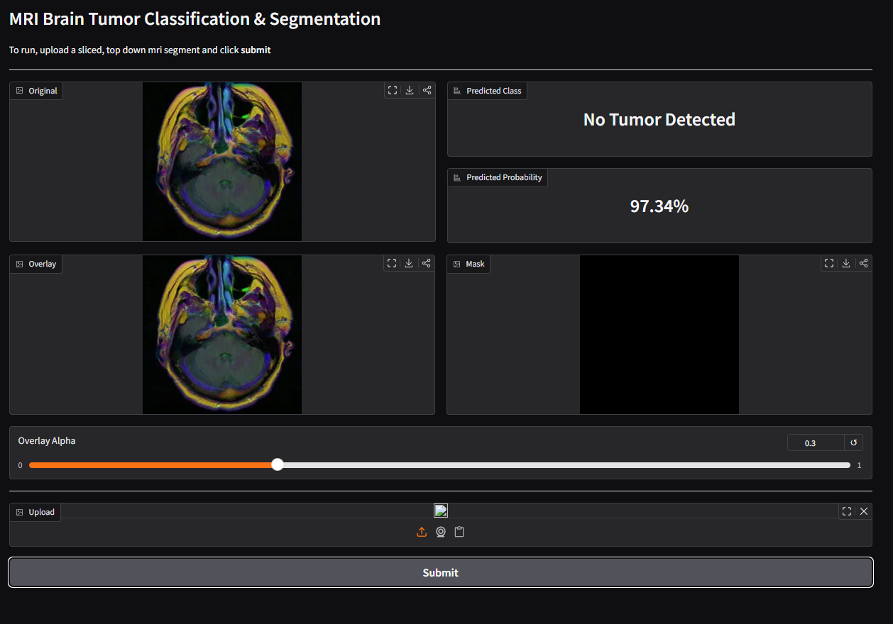
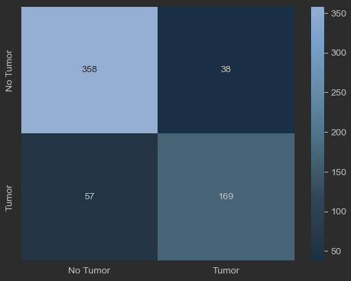
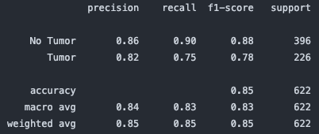
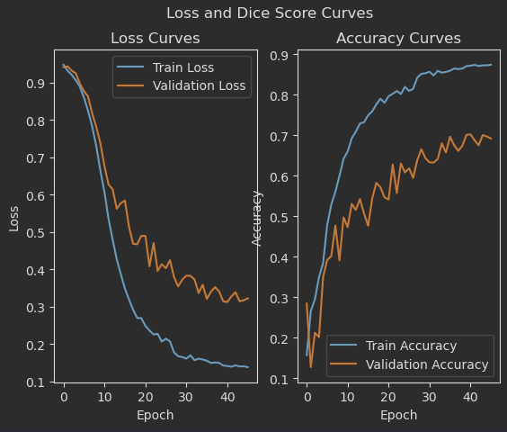

# Brain Tumor Segmentation using UNET and Resnet-18 Architectures

### Problem Statement
The goal of this project is to develop deep learning models for brain tumor classification and segmentation using 
ResNet-18 and U-Net architectures. Brain tumor detection is a critical task in medical imaging, as it helps in the 
diagnosis, treatment planning, and monitoring of brain tumors. These models can be used to automatically classify and 
segment brain tumors from MRI scans in a prescreening process, which can assist radiologists in making accurate 
diagnoses and treatment decisions.

### Demo Images
#### Initial Load of webpage with no image uploaded:


#### Example of positive case with tumor present in the segment:


#### Example of alpha slider on segment with tumor present:


#### Example of negative case with no tumor present in the segment:


### Dataset
The dataset used to train, validate, and test the model can be found at:
https://www.kaggle.com/datasets/mateuszbuda/lgg-mri-segmentation

This dataset contains brain MR images together with manual FLAIR abnormality segmentation masks. The images were obtained 
from The Cancer Imaging Archive (TCIA). They correspond to 110 patients included in The Cancer Genome Atlas (TCGA) lower-grade 
glioma collection with at least fluid-attenuated inversion recovery (FLAIR) sequence and genomic cluster data available. 
Tumor genomic clusters and patient data is provided in data.csv file. For more information on genomic data, refer to the publication 
"Comprehensive, Integrative Genomic Analysis of Diffuse Lower-Grade Gliomas" and supplementary material available at 
https://www.nejm.org/doi/full/10.1056/NEJMoa1402121

### Model Architecture
There are two architectures being implemented in this project, the UNET architecture for segmentation and the ResNet-18 
architecture for classification. Resnet was built using transfer learning with preliminary training done on the last 
layer with the two outputs while freezing the other layers. This model was then trained again freezing all layers but 
the last two, including the last convolutional layer. The output is a binary classification of whether a tumor is present 
in the segment or not, along with a confidence score.

The UNET architecture is used for segmentation of the tumor within the brain. The UNET architecture was built from scratch 
and trained on the same dataset as the ResNet-18 model. The output is a binary mask that highlights the tumor area within 
the brain segment. The UNET model has 4 encoder layers and 4 decoder layers, with skip connections between the corresponding 
encoder and decoder layers. Each encoder layer consists of two convolutional layers followed by a max pooling layer, while 
each decoder layer consists of an upsampling layer followed by two convolutional layers. The final output layer is a 
convolutional layer with a sigmoid activation function that produces the binary mask for tumor segmentation.

### Results

#### ResNet-18 Classification Model
Current performance shows that of a total 622 individual MRI segments, the model predicted the proper outcome with an 
accuracy of ~85%. This implies that ~15% of the time the model either gave a false positive (~6%) or false negative (~9%).
The harmful metric being the false negative in this model's case at ~10%.

Rows = Actual <br>
Columns = Prediction <br>
 <br>


#### UNET Segmentation Model
The U-Net model achieves a dice score of ~0.87 on the training set and ~0.70 on the validation set, demonstrating that the
model has learned meaningful tumor boundaries from the MRI scans. The validation dice score of 0.70 indicates reasonable 
segmentation performance, particularly given the model was built from scratch and trained on a relatively small dataset of 
110 patients. Through multiple iterations of training and hyperparameter tuning, the model converged at its best validation 
loss of 0.3127 (compared to 0.1415 on training), revealing a generalization gap that is common when training on limited 
medical imaging data. Potential next steps to close this gap include adding stronger data augmentation, experimenting with 
deeper architectures or attention mechanisms, and training on a larger dataset.

 <br>

### How to Use the Model
1. Download the dataset from [Kaggle](https://www.kaggle.com/datasets/mateuszbuda/lgg-mri-segmentation) and extract it 
into `data/raw/lgg-mri-segmentation/` so that the patient folders are located at `data/raw/lgg-mri-segmentation/kaggle_3m/`.

2. Create a virtual environment and install the required dependencies. Either in conda or venv, the requirements.txt file 
contains all the necessary packages to run the model.
```bash
conda create -n brain-tumor-segmentation python=3.11
conda activate brain-tumor-segmentation
pip install -r env/requirements.txt
```

```bash
python -m venv brain-tumor-segmentation
source brain-tumor-segmentation/bin/activate  # On Windows, use `brain-tumor-segmentation\Scripts\activate`
pip install -r env/requirements.txt
```

#### Deployed Model
run the python file `app.py` to start the Gradio server. This will allow you to access the model through a web interface.
```bash
python app.py
```

#### Training the Classification Model (ResNet-18)
Training is done through Jupyter notebooks. Open and run all cells in `notebooks/04_model_pipeline_train.ipynb`.

The notebook performs the following steps:
1. Runs a data integrity check on the raw dataset
2. Splits patients into train/validation/test sets (stratified, seed=42)
3. Creates DataLoaders (batch_size=32)
4. Trains a **Baseline CNN** as a benchmark (15 epochs, patience=5, lr=1e-3, CrossEntropyLoss)
5. Trains **ResNet-18** — first pass with only the final layer unfrozen (lr=1e-3)
6. Trains **ResNet-18** — second pass unfreezing layer4, adding dropout (p=0.5), and lowering the learning rate (lr=1e-4)
7. Saves trained weights to the `models/` directory

#### Training the Segmentation Model (U-Net)
Open and run all cells in `notebooks/07_UNet_Train_Pipeline.ipynb`.

The notebook performs the following steps:
1. Runs the same data integrity check and patient split as above
2. Creates DataLoaders with segmentation masks (batch_size=32)
3. Trains the **U-Net** model (3 input channels, 1 output channel) using DiceLoss and Adam optimizer (lr=1e-4)
4. Saves trained weights to the `models/` directory

> **Note:** A CUDA-enabled GPU is recommended. Training will fall back to MPS or CPU if CUDA is unavailable, but will be significantly slower.

#### Saving and Loading Model Weights
Trained weights are saved automatically at the end of each training notebook using `save_weights()`, which stores the model state dict to the `models/` directory with a timestamped filename (e.g. `resnet18_2026-03-21_11h03-39s.pth`).

To load saved weights into a model for inference or further training:
```python
from src.Model.persistance import load_weights

# Example: loading ResNet-18 weights
load_weights(model, Path("models/resnet18_2026-03-21_11h03-39s.pth"), device)
model.to(device)
```

### Project Structure
```
  BrainTumorMRIClassification/
  ├── app.py                                # Gradio web application
  ├── MODEL_CARD.md                         # Model documentation & limitations
  ├── data/
  │   ├── raw/                              # Original Kaggle dataset
  │   │   └── lgg-mri-segmentation/
  │   │       └── kaggle_3m/                # Patient folders with .tif images & masks
  │   └── processed/
  │       └── cache/                        # Cached data integrity results
  ├── notebooks/
  │   ├── 01_data_exploration.ipynb         # EDA & class distribution analysis
  │   ├── 02_data_pipeline.ipynb            # Dataset, transforms, DataLoaders
  │   ├── 03_model_pipeline.ipynb           # Baseline CNN & ResNet-18 setup
  │   ├── 04_model_pipeline_train.ipynb     # Classification training
  │   ├── 05_model_pipeline_test.ipynb      # Evaluation & metrics
  │   ├── 06_GradCam_pipeline.ipynb         # Grad-CAM visualizations
  │   ├── 07_UNet_Train_Pipeline.ipynb      # U-Net segmentation training
  │   └── 08_UNet_Predict_Pipeline.ipynb    # U-Net inference & IoU
  ├── src/
  │   ├── main.py                           # Entry point / inference script
  │   ├── DataIntegrity/
  │   │   └── data_integrity.py             # Corrupt image & label mismatch checks
  │   ├── Dataset/
  │   │   ├── mri_dataset.py                # Custom PyTorch Dataset class
  │   │   ├── mri_split.py                  # Stratified train/val/test splits
  │   │   ├── transforms.py                 # Data augmentation transforms
  │   │   ├── data_loaders.py               # DataLoader factory
  │   │   └── cache.py                      # Dataset caching utilities
  │   ├── Model/
  │   │   ├── train.py                      # Training loop with early stopping
  │   │   ├── evaluation.py                 # Metrics, confusion matrix, F1
  │   │   ├── persistance.py                # Model save/load with metadata
  │   │   ├── Baseline/
  │   │   │   └── baseline_cnn.py           # Simple CNN baseline
  │   │   ├── Resnet/
  │   │   │   ├── mri_resnet.py             # Fine-tuned ResNet-18
  │   │   │   ├── predict.py                # Classification inference
  │   │   │   └── GradCAM.py                # Grad-CAM heatmap generation
  │   │   └── Unet/
  │   │       └── Unet.py                   # U-Net segmentation model
  │   ├── Typedef/
  │   │   └── Patients.py                   # Patient data structures
  │   └── Visualization/
  │       └── visualization.py              # Plotting utilities
  ├── models/                               # Saved model weights (.pth)
  └── outputs/                              # Loss curves, confusion matrices, etc.
```

### Limitations
**NOT A PRODUCTION-LEVEL MODEL**<br>
This is a model built as a student project. Currently, the model is overfitting, and the heatmap is generalized over the 
whole brain segment. Neither is giving an accurate display of a tumor being present. This model version is prone to false
negatives that are harmful to misdiagnose a patient who in fact has a tumor. The goal would be to train this model to a 99.999% recall score as
missing a tumor (false negative) is more dangerous than a false alarm (false positive), therefore recall is the priority metric over precision.